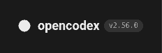

# Sidebar version badge: layout evidence

Code snapshot: `4c675bd416aa7bf64bb7a78a4cd9a83baaf3a03c`.

This is an actual Chromium 144.0.7559.96 screenshot of an isolated header fixture, not a production dashboard build. The fixture copies the repository's header layout rules and applies `gui/src/styles/sidebar-brand.css`. A placeholder logo keeps the original 26px layout dimensions. The screenshot uses the 232px rail and a wider-font stress case (18px brand name and generic monospace version); it was palette-compressed without changing the text or layout. It is not a claimed screenshot of the reporter's running instance.

## Geometry checks performed

96 cases passed: two color schemes, eight viewport widths (320, 360, 375, 414, 760, 761, 1024, 1920), three version strings, and two typography cases (repository token defaults and the wider-font stress case).

Versions: `2.56.0`, `2.56.0-beta.1`, and `2.56.0-preview.20260916+` followed by a 64-character unbroken build identifier.

Checks: rendered text remains inside its badge; the badge remains inside its brand container; it does not overlap the drawer close control; compact mobile topbar geometry is identical before and after. The wider-font desktop case reproduces clipping of `v2.56.0` before the patch and verifies a full single-line badge after it.

## Not verified here

The container has no Bun installation and could not resolve `codeload.github.com`, so a fresh checkout/dependency install and the repository's Bun tests, full GUI lint, and production build were not run. The change is submitted as a draft pending those gates. The separate evidence branch keeps screenshots out of the source PR diff.
